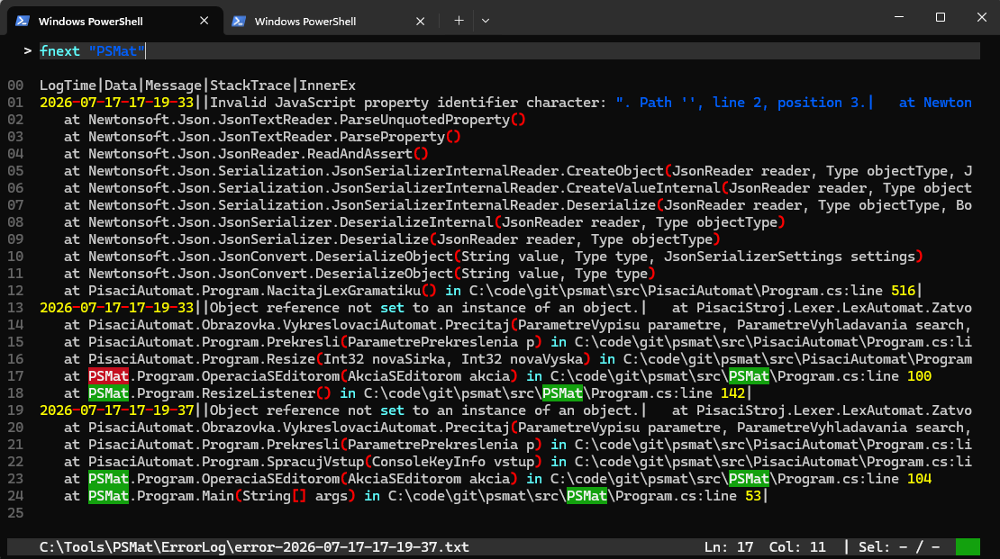

# PSMat
PSMat is simple text editor built for educational purposes to supplement bachelor thesis about data structures and algorithms used in text editors.

## Table of Contents
- [Introduction](#introduction)
- [Installation](#installation)
- [Usage](#usage)
- [Features](#features)
- [Contributing](#contributing)
- [License](#license)

## Introduction
The purpose of this program is to educate oneself about data structures and algorithms needed to build a "notepad with syntax highlighting", and try how hard (or easy) it is to create such app. The code is written in C# but no strict rules were followed when it comes to code architecture or programming paradigm / style. Originally there was no plan to put this code on GitHub and so no need for it to be international. As a result, naming of variables and functions in code may be a bit confusing for reader.

## Installation
Application was built and tested on Windows 11 and there is no guarantee below works on other systems too.

1. Download and install .NET 10 SDK from [https://dotnet.microsoft.com/en-us/download/dotnet/10.0](https://dotnet.microsoft.com/en-us/download/dotnet/10.0) 

2. Clone the repository or download as zip
``` PowerShell
# Clone the repository
git clone https://github.com/madamjak/psmat.git
```

3. Build and install using the ps script in repo
``` PowerShell
# Navigate into the /scripts folder
cd psmat/scripts

# Run install script there, use -Overwrite parameter to overwrite files in existing PSMat folder
.\install-psmat.ps1 -ProgramPath "C:\Tools" -Scope User -Rebuild -Overwrite
```

## Usage
Ilustrated example installation should create PSMat directory in `C://Tools/PSMat` and add given directory to the PATH environment variable.
After that can execute the command `psmat <file in current directory OR absolute path to file>` from any location to open the editor.
It's possible to run the command without parameters too and input the file location when prompted.

``` PowerShell/
# Open any example file
psmat C:\Tools\PSMat\ErrorLog\error-2026-07-17-17-19-37.txt
```
Default config works somewhat nicely with the exceptions and so reading stack traces may be one accidental good use for the editor.



## Features
The editor offers basic text editing features you would expect from a text editor, supplemented by configurable syntax highlighting and search feature. Text editing operations were designed in the attempt to be standard and usual for most users. Some of the keyboard shortcuts may be conflicting with Windows Terminal, and it may be needed to change Terminal settings to be able to use them with editor. 
Personally I needed to change for example [Ctrl] + [V] for paste or [Ctrl] + [Shift] + [Home] to select text from cursor to beginning.

Syntax highlight is configurable via Jazyk.json file located in ```/Config``` folder in your installation location. Example simple config shown bellow. 
``` JSON
{
	"Jazyky" : [
		{
			"Pripona": ".cs", 
			"JednoriadkovyKomentar": "//",
			"ZaciatokKomentara": "/*",
			"KoniecKomentara": "*/",
			"Pravidla":[
				{
					"TypTokenu":0,
					"Regex":"((n.u.l.l)|(i.f)|(e.l.s.e)|(f.o.r.e.a.c.h)|(v.a.r)|(b.o.o.l)|(g.e.t)|(s.e.t)).\u0000"
				}
			]
		}
	]
}
```
The file allows to configure multiple languages. Editor identifies language based on file extension. Config allows to configure symbols for the source code comments, and define list of regular expressions to match programming language keywords or other token types supported by editor. Editor is using own naive implementation of regex engine and only basic regex operations (concatenation/alternation/closure) are supported.


Searching is allowed via 'editor command line' which can be displayed using [Ctrl] + [W] and closed using [Esc], quick search (`fnext`) is also possible using [Ctrl] + [F]. 
Strings being searched should be escaped in quotes. Full list of search commands below.
``` PowerShell
# find all occurences of string
fall "string" 

# find next occurence of string
fnext "string" 

# find previous occurence of string
fprev "string" 

# replace first occurence of string1 with string2
rfrst "string1" "string2" 

# replace all occurences of string1 with string2
rall "string1" "string2" 
```

Edited file can be saved using [Ctrl] + [S] shortcut, which triggers editor command ```saas "file path"```. Given command can be also used for 'save as' function using [Ctrl] + [N] shortcut.

## Contributing
If you wish to contribute to this repository, then create issue to track your change and then create PR.
``` PowerShell/
# Create branch
git checkout -b example-issue

# Commit
git commit -m 'Example issue'

# Push and create PR
git push -u origin example-issue
```

## License
The project is unlicensed, see the [LICENSE](LICENSE) file for details. 
